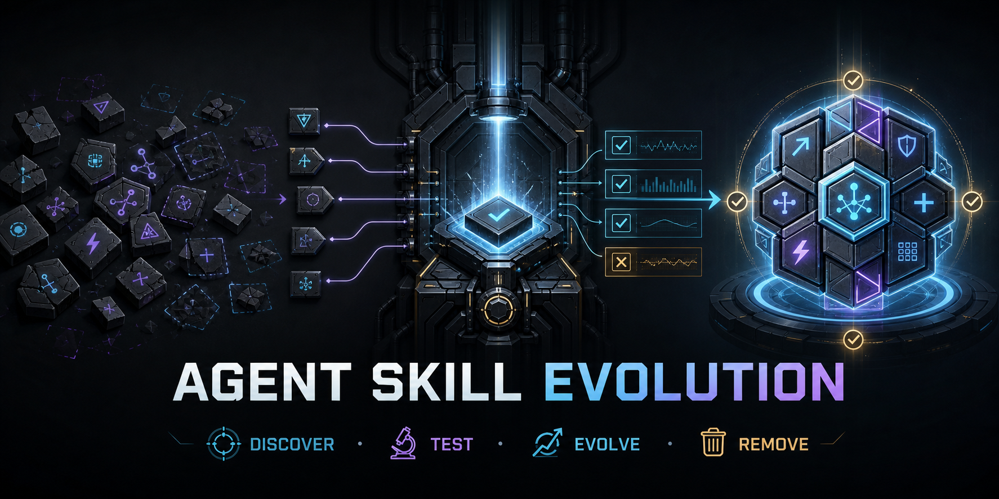

<p align="center">
  
</p>

# Agent Skill Evolution

**Evolution, not accumulation.** A native-Skill lifecycle system for engineers
who use Codex and Claude and want capabilities to improve without turning their
context into an attic.

[](https://github.com/hanzw/agent-skill-evolution/actions/workflows/test.yml)
[](https://github.com/hanzw/agent-skill-evolution/releases)
[](LICENSE)

The public capability is the **Skill layer**: discover, update, evaluate,
deduplicate, and remove reusable procedures. Hooks, ReMe, receipts, and
`launchd` are an optional support implementation—not a new kind of capability.

## Three concepts that should not be mixed

| Concept | What it actually is | Relationship to this repository |
| --- | --- | --- |
| [Google Agent Development Kit (ADK)](https://google.github.io/adk-docs/) | A code-first framework for building, orchestrating, evaluating, and deploying agent applications | Compatible, but neither required nor bundled |
| Agent Skill Evolution | Lifecycle governance for portable, natively discovered Agent Skills | The product and public abstraction in this repository |
| [Viktor's “Glorious Evolution”](https://www.leagueoflegends.com/en-gb/champions/viktor/) | A League of Legends fictional narrative about biomechanical transformation | A loose metaphor for deliberate capability improvement only |

The artwork in this repository is original and depicts capability modules moving
through tests. It does not reproduce Viktor, Riot artwork, logos, costumes, game
UI, or other League of Legends assets. This project is not affiliated with or
endorsed by Riot Games or Google.

## Who this is for

- Engineers using Codex and Claude across several repositories.
- Skill-heavy setups that install more capabilities than they retire.
- Teams that need one canonical source per capability across project, global,
  and plugin scopes.
- Long-running agent users who need bounded durable history without confusing
  memory, task state, authorization, and Skills.

It is not an ADK, model router, multi-agent orchestrator, prompt collector, or
replacement for repository rules. The optional support installer is macOS-first
because its ReMe service and heartbeat use `launchd`.

## The pain it removes

| Pain | Skill-layer answer |
| --- | --- |
| More Skills are installed but nothing is removed | Explicit discover/update/evaluate/remove lifecycle |
| Project, global, and plugin copies drift | One canonical source per capability |
| Similar Skills compete for attention | Native inventory plus targeted Promptfoo ablation |
| Memory, plans, permissions, and Skills overlap | Each concern has one owner |
| Codex and Claude apply different global controls | Optional shared Hook and policy implementation |
| Global changes are hard to reproduce | Versioned support releases, receipts, backups, and rollback |

## Layer model

```text
Agent application / ADK  -> builds and runs agents
Native Agent Skills      -> reusable capability truth
Repository files/tests   -> current project truth
Buildomator / HANDOFF     -> current long-task state
ReMe                     -> bounded durable history
Policy Hooks             -> side-effect authorization
Promptfoo                -> controlled Skill ablation
```

Native Codex/Claude discovery remains authoritative. There is no shadow
capability registry. See [the architecture document](docs/architecture.md) for
the ownership boundaries and optional support flow.

## Included Skills

| Skill | Role |
| --- | --- |
| `evolve-skills` | Audit a Skill portfolio, update canonical sources, deduplicate, and remove obsolete capabilities |
| `skill-governance` | Decide keep/update/remove for one uncertain Skill using a minimal Promptfoo ablation |
| `first-principles-checkpoint` | Stop scope and context drift at major decision points |

Install all three from their canonical GitHub source:

```bash
npx skills@latest add hanzw/agent-skill-evolution \
  --skill evolve-skills skill-governance first-principles-checkpoint \
  --global --agent codex claude-code --yes
```

If upgrading from v2.0.0, remove the retired abstraction after installing the
replacement:

```bash
npx skills@latest remove agent-runtime \
  --global --agent codex claude-code --yes
```

`skill-governance` uses the upstream `promptfoo-evals` and
`promptfoo-provider-setup` Skills rather than copying them:

```bash
npx skills@latest add promptfoo/promptfoo \
  --skill promptfoo-evals promptfoo-provider-setup \
  --global --agent codex claude-code --yes
```

Already-running agents normally discover Skill changes on their next turn or
session. Buildomator is the current name for GSD 4.x; use `/bm:` for new task
state commands.

## Optional support layer

The repository also contains a small shared implementation for Codex and Claude:

- one lifecycle Hook dispatcher and deterministic side-effect policy;
- private bounded evidence without raw prompts, commands, or tool payloads;
- ReMe `0.4.1.3` with BM25, project namespaces, and bounded recall;
- atomic installation, immutable releases, provenance, backup, rollback, and
  health verification.

Requirements: macOS, Git, Python 3.11, an existing Codex or Claude setup, and
network access to the canonical Python package sources.

```bash
git clone https://github.com/hanzw/agent-skill-evolution.git
cd agent-skill-evolution
python3 -m unittest discover -s tests -v
python3.11 -m agent_runtime.installer install --source .
```

The internal package remains named `agent_runtime` because it implements Hook,
policy, memory, and service execution. It is deliberately not exposed as a
Skill capability.

| Dependency | Support role |
| --- | --- |
| [`reme-ai==0.4.1.3`](https://pypi.org/project/reme-ai/) | Local durable-memory MCP and file workspace |
| [`agentscope==2.0.4`](https://pypi.org/project/agentscope/) | Pinned ReMe dependency |
| Native Codex/Claude Hooks | Lifecycle delivery and side-effect policy |

No dependency is vendored. The installer does not delete Skills, migrate
personal logs, remove unrelated MCP servers, or edit project repositories.

### Managed changes

- Codex and Claude user Hook configuration;
- the minimum Codex policy fields and loopback ReMe MCP entry;
- only the global `Memory Model` instruction section;
- private releases, backups, receipts, evidence, and ReMe environment;
- two user-level `launchd` services.

## Update and roll back

```bash
git pull --ff-only
python3 -m unittest discover -s tests -v
python3.11 -m agent_runtime.installer install --source .
npx skills@latest update evolve-skills skill-governance \
  first-principles-checkpoint --global --yes
```

Every support-layer installation records an exact backup path:

```bash
python3.11 -m agent_runtime.installer rollback \
  --backup <exact-backup-path-from-install-receipt>
```

## Small configuration surface

- Skill lifecycle rules: `skills/evolve-skills` and `skills/skill-governance`.
- Side-effect policy: `agent_runtime/policy.py` plus focused tests.
- Memory bounds: `agent_runtime/memory.py` and `reme-minimal.yaml`.
- Installation targets: `agent_runtime/installer.py`.

That is the full configuration surface. Add an abstraction only after a second
real use case proves it is needed.

Read [SECURITY.md](SECURITY.md) before installing the optional support layer.
MIT licensed. Banner generated for this repository with OpenAI image generation.
