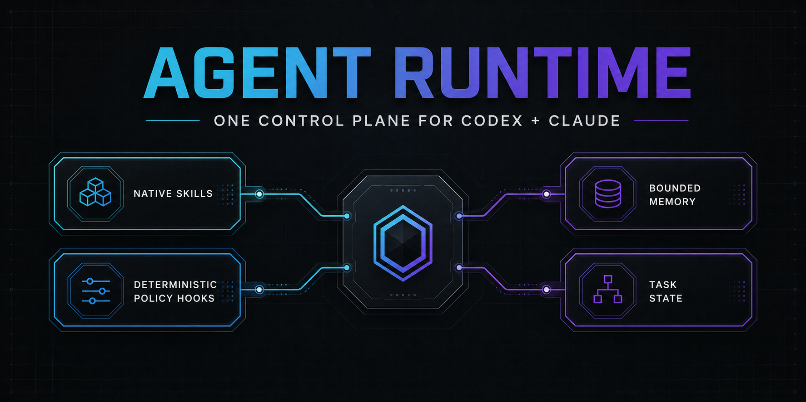

<p align="center">
  
</p>

# Agent Runtime

One reversible control plane for engineers who use **Codex and Claude on the
same machine** and are tired of duplicated Hooks, drifting memory, Skill sprawl,
and global configuration that nobody can safely explain or roll back.

[](https://github.com/hanzw/agent-runtime/actions/workflows/test.yml)
[](https://github.com/hanzw/agent-runtime/releases)
[](LICENSE)

## Who this is for

- Engineers running both Codex and Claude across several repositories.
- Small teams that want autonomous routine work with deterministic hard stops.
- Long-running agent users who need durable history without injecting an
  unbounded transcript into every session.
- Skill-heavy setups that need evidence for keep/update/remove decisions.

It is intentionally macOS-first because the managed ReMe service and health
heartbeat use `launchd`. It is not a model router, multi-agent orchestrator,
prompt collector, or replacement for repository rules.

## The pain it removes

| Pain | Runtime answer |
| --- | --- |
| Codex and Claude execute different global rules | One Hook dispatcher and one policy implementation |
| Several memory systems contradict current code | ReMe stores only durable history; repository state remains current truth |
| More Skills are installed but nothing is removed | Promptfoo ablation supports explicit keep/update/remove decisions |
| Hooks accumulate raw prompts, commands, and secrets | Evidence contains allowlisted metadata and keyed fingerprints only |
| Global edits are risky and hard to reproduce | Versioned releases, atomic writes, receipts, backups, and exact rollback |
| Task state, memory, Skills, and permissions overlap | Each concern has one owner and a documented boundary |

## Architecture

```text
Native Skill discovery  -> reusable capability truth
Repository files/tests  -> current project truth
Buildomator/HANDOFF      -> current long-task state
ReMe                     -> bounded durable history
Policy Hooks             -> side-effect authorization
Promptfoo                -> controlled Skill ablation
```

The runtime does not install a shadow capability registry. Project Skills stay
in their repositories. Upstream Skills stay owned by their upstream GitHub
sources. See [the architecture document](docs/architecture.md) for data flow,
policy classes, privacy guarantees, and failure behavior.

## Included capabilities

- Shared Codex and Claude lifecycle Hooks.
- Fail-closed blocking for destructive commands, verification bypasses,
  protected-branch direct writes, and unversioned global runtime edits.
- Audit-only classification for production deploy and remote D1 operations;
  repository evidence gates retain authority.
- Private, bounded event evidence without raw tool content.
- ReMe `0.4.1.3` on loopback with BM25, wikilinks, project namespaces, and no
  embedding/vector database.
- Atomic installation, immutable releases, source provenance, automatic backup,
  rollback, health heartbeat, and read-after-write verification.
- `agent-runtime` Skill for audit/install/update/rollback operations.
- `first-principles-checkpoint` Skill for stopping process and context drift.
- `skill-governance` Skill and a two-arm Promptfoo eval template.

## Install the runtime

Requirements: macOS, Git, Python 3.11, an existing Codex or Claude setup, and
network access during installation so Python can pull pinned ReMe packages from
PyPI.

```bash
git clone https://github.com/hanzw/agent-runtime.git
cd agent-runtime
python3 -m unittest discover -s tests -v
python3.11 -m agent_runtime.installer install --source .
```

The installer directly pulls these runtime dependencies from their canonical
package source:

| Dependency | Role | Adjust when |
| --- | --- | --- |
| [`reme-ai==0.4.1.3`](https://pypi.org/project/reme-ai/) | Local durable-memory MCP and file workspace | ReMe behavior or protocol compatibility changes |
| [`agentscope==2.0.4`](https://pypi.org/project/agentscope/) | ReMe runtime dependency | The pinned ReMe release requires another version |
| Native Codex/Claude Hooks | Lifecycle delivery and Skill discovery | Either runtime changes its Hook schema |

No dependency source is vendored and the installer does not rewrite unrelated
MCP package versions.

### What installation changes

- `CODEX_HOME/hooks.json`: replaces the user-level Hook graph.
- `CLAUDE_HOME/settings.json`: replaces only the `hooks` field.
- `CODEX_HOME/config.toml`: enables Hooks, sets `workspace-write`, `on-request`,
  `auto_review`, workspace network access, and the loopback ReMe MCP.
- Claude's user configuration: adds or updates only the `reme` MCP entry.
- Global Codex and Claude instructions: adds or replaces only `Memory Model`.
- `AGENT_RUNTIME_HOME`: writes private releases, backups, receipts, state, and
  the pinned ReMe environment.
- The user LaunchAgents directory: installs runtime heartbeat and ReMe services.

The installer does **not** delete Skills, migrate personal logs, remove other
MCP servers, or edit project repositories.

## Install the Skills

The native [`skills`](https://www.npmjs.com/package/skills) installer pulls each
Skill directly from its canonical GitHub repository:

| Skill | Role | Adjust when |
| --- | --- | --- |
| `agent-runtime` | Audit, install, update, diagnose, and roll back the runtime | Managed files, service model, or verification changes |
| `first-principles-checkpoint` | Stop scope/context drift and choose the next smallest proof | The subtraction decision rule changes |
| `skill-governance` | Decide keep/update/remove for one Skill | Lifecycle evidence requirements change |
| `promptfoo-evals` | Author and run controlled eval suites | Cases or assertions change |
| `promptfoo-provider-setup` | Connect Promptfoo to the evaluated runtime | Authentication or provider mapping changes |

```bash
npx skills@latest add hanzw/agent-runtime --skill agent-runtime \
  --global --agent codex claude-code --yes
npx skills@latest add hanzw/agent-runtime --skill skill-governance \
  --global --agent codex claude-code --yes
npx skills@latest add hanzw/agent-runtime --skill first-principles-checkpoint \
  --global --agent codex claude-code --yes
npx skills@latest add promptfoo/promptfoo --skill promptfoo-evals \
  --global --agent codex claude-code --yes
npx skills@latest add promptfoo/promptfoo --skill promptfoo-provider-setup \
  --global --agent codex claude-code --yes
```

Already-running agents discover newly installed Skills on their next turn or
session. Buildomator is the current name for GSD 4.x; use `/bm:` for new task
state commands.

## Update

```bash
git pull --ff-only
python3 -m unittest discover -s tests -v
python3.11 -m agent_runtime.installer install --source .
npx skills@latest update agent-runtime skill-governance \
  first-principles-checkpoint --global --yes
```

## Roll back

Every successful install prints and records its exact backup path in the
runtime receipt.

```bash
python3.11 -m agent_runtime.installer rollback \
  --backup <exact-backup-path-from-install-receipt>
```

Rollback restores managed configuration bytes and prior service definitions.
It never deletes immutable runtime releases or evidence directories.

## Adjust policy without growing another framework

Policy behavior lives in `agent_runtime/policy.py`; every changed rule requires
a focused case in `tests/test_policy_runtime.py`. Memory limits live in
`agent_runtime/memory.py` and `agent_runtime/reme-minimal.yaml`. Installation
targets live in `agent_runtime/installer.py`.

That is the entire configuration surface. Add a new abstraction only after a
second real use case proves it is needed.

## Security

Read [SECURITY.md](SECURITY.md) before installation. The installer changes
user-level agent configuration and should be reviewed like any other execution
policy. Report vulnerabilities through GitHub private security advisories.

MIT licensed. Banner generated for this repository with OpenAI image generation.
