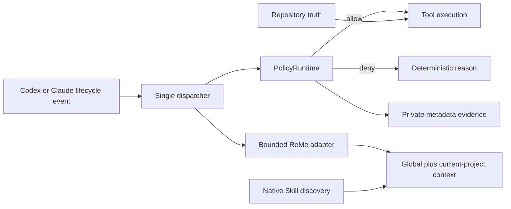

# Skill Evolution Architecture

Agent Skill Evolution treats the native Skill as the reusable capability unit.
The repository also includes an optional user-level support runtime shared by
Codex and Claude, but that implementation does not become a capability registry.

## Terminology boundary

| Layer | Responsibility | Not responsible for |
| --- | --- | --- |
| ADK or agent application framework | Build, orchestrate, evaluate, and deploy agent applications | Governing every installed native Skill |
| Native Agent Skill | Package reusable instructions, workflows, tools, and resources | Long-task state, memory, or authorization |
| Skill evolution | Discover, update, evaluate, deduplicate, and remove Skills | Running an agent application |
| Support runtime | Deliver Hooks, enforce side-effect policy, recall bounded history | Defining a second capability type |

“Glorious Evolution” is only a fictional visual metaphor. The architecture is a
practical Skill lifecycle and has no game mechanics, character model, or Riot
asset dependency.

## First principles

1. One concern has one canonical owner.
2. Authorization is independent from capability instructions.
3. Current repository evidence outranks remembered history.
4. Safety decisions fail closed; optional context and observers fail open.
5. Installation must be atomic, attributable, and reversible.
6. Evidence must prove behavior without retaining sensitive content.

## Ownership boundaries

| Concern | Canonical owner | Explicit non-owner |
| --- | --- | --- |
| Current code and operational truth | Repository, tests, contracts, live reads | ReMe |
| Reusable procedure | Native Codex/Claude Skill discovery | Support runtime registry |
| Current long-task continuation | Buildomator STATE or HANDOFF | ReMe |
| Durable cross-session history | ReMe | Task state files |
| Side-effect authorization | Policy Hooks plus repository evidence gates | Skills |
| Skill lifecycle evidence | Promptfoo ablation | Production telemetry |

## Support runtime flow



Codex and Claude receive different native Hook payloads, but both invoke the
same Python dispatcher. The dispatcher normalizes the small subset needed for
policy classification and evidence.

## Policy model

The default policy is intentionally small:

| Effect | Support behavior |
| --- | --- |
| Broad destructive filesystem or Git operation | Block |
| Verification bypass | Block |
| Direct write to `main` or `master` | Block |
| Direct mutation of global agent runtime configuration | Block |
| Production deploy command | Audit and defer to repository gates |
| Remote Cloudflare D1 operation | Audit and defer to repository gates |
| Proven read-only global configuration inspection | Allow |
| Exact single `git stash drop stash@{N}` | Allow |
| Unclassified routine work | Allow |

The support runtime does not encode application names, database names, deployment
accounts, or business authorization. Those belong in each repository.

### Evidence schema

Each event record contains only:

- timestamp;
- lifecycle event;
- tool name;
- hashed session identity;
- repository-directory basename;
- classified effect;
- keyed input fingerprint;
- response value type.

It does not contain prompt text, command text, tool input, tool output, tokens,
cookies, full paths, or secrets. Files and lock keys use private permissions and
atomic replacement. Event files rotate at a bounded size.

## Memory model

The support runtime pins ReMe `0.4.1.3` and AgentScope `2.0.4` in a private Python 3.11
environment. ReMe runs as a loopback MCP service with a file-native workspace.

The supplied profile intentionally enables only:

- BM25 search and wikilinks;
- file-backed notes;
- allowlisted search and file operations;
- global plus current-project recall.

It disables embeddings, vector storage, agent wrappers, automatic memory
extraction, proactive interests, dream jobs, and raw-session ingestion.

Recall is fail-open, limited to three results, capped at 4 KiB, and constrained
to global memory plus the current repository's hashed namespace. Git worktrees
resolve to the main repository namespace; submodules retain independent
namespaces.

## Skill evolution model

The support runtime does not copy, rank, or promote Skills. Native discovery remains
authoritative:

```text
project-local Skills -> project-specific procedure
user-global Skills   -> reusable procedure across projects
plugin Skills        -> versioned upstream capabilities
```

`evolve-skills` owns portfolio-level inventory, canonical-source selection,
updates, deduplication, and removal. It delegates uncertain value decisions to
`skill-governance` instead of duplicating the evaluation procedure.

`skill-governance` adds a controlled two-arm Promptfoo evaluation for one Skill
at a time. It requires the same model and task in baseline and treatment arms,
confirms actual Skill loading, and returns keep/update/remove evidence. It is
not a second capability registry.

`first-principles-checkpoint` is the subtraction mechanism: at decision points
it restates the outcome, known evidence, next smallest proof, and work to defer.
It does not own task state or create another planning format.

## Installation transaction

Installation performs these phases:

1. Resolve the source revision and dirty state.
2. Create a timestamped private backup and manifest.
3. Build a content-addressed immutable runtime release.
4. Atomically switch the current runtime symlink.
5. Replace user-level Hook graphs while preserving unrelated Claude settings.
6. Update the minimum Codex policy fields and ReMe MCP entry.
7. Add or replace only the global `Memory Model` instruction section.
8. Install pinned ReMe packages directly from PyPI.
9. Install and bootstrap two launchd services.
10. Verify ReMe version, private permissions, write, read, search, edit, delete,
    and reindex behavior.
11. Write the source-bound installation receipt.

If any phase fails, managed files are restored from the backup before the
installer raises the error. Rollback never removes immutable releases or event
evidence.

## Managed lifecycle events

Codex:

```text
PreToolUse, PermissionRequest, PostToolUse, PreCompact, PostCompact,
SessionStart, SubagentStart, UserPromptSubmit, SubagentStop, Stop, SessionEnd
```

Claude:

```text
PreToolUse, PostToolUse, PostToolUseFailure, PreCompact, SessionStart,
UserPromptSubmit, Stop, SessionEnd
```

Every event has an explicit timeout. `SessionEnd` uses three seconds. Safety
events fail closed on malformed JSON or runtime error. Memory, maintenance, and
post-event observers return an empty success response when unavailable.

## Service model

The macOS installation creates:

- `io.github.hanzw.agent-runtime`: six-hour health and permissions heartbeat;
- `io.github.hanzw.agent-runtime.reme`: persistent loopback ReMe service.

These service labels remain stable during the v2 line for upgrade compatibility;
their names describe the internal implementation, not a public Skill capability.

Both run at user level. ReMe uses a restrictive umask, private workspace
permissions, and local-only transport. `--no-launchd` exists for synthetic test
homes and unsupported environments; it does not provide a production service
manager.

## Deliberate exclusions

This repository does not provide:

- a model router;
- an agent orchestrator;
- a second Skill registry;
- prompt or transcript analytics;
- automatic Skill promotion;
- application-specific production authorization;
- PageIndex, Buildomator, or Promptfoo as bundled dependencies.

Those systems may integrate at their documented boundary without becoming part
of the Skill layer.

## Where to adjust behavior

| Change | Source | Required evidence |
| --- | --- | --- |
| Add or relax one policy classification | `agent_runtime/policy.py` | Focused policy test |
| Change recalled scope or budget | `agent_runtime/memory.py` | Isolation and bound tests |
| Change ReMe capabilities | `agent_runtime/reme-minimal.yaml` | Profile and live smoke test |
| Change managed files or lifecycle graph | `agent_runtime/installer.py` | Install, idempotency, rollback tests |
| Change Skill decision rules | `skills/skill-governance` | Promptfoo ablation |
| Change portfolio lifecycle rules | `skills/evolve-skills` | Native before/after discovery |

Avoid adding a generic configuration layer for a one-off rule. The source plus
focused tests is the intended five-minute explanation surface.
